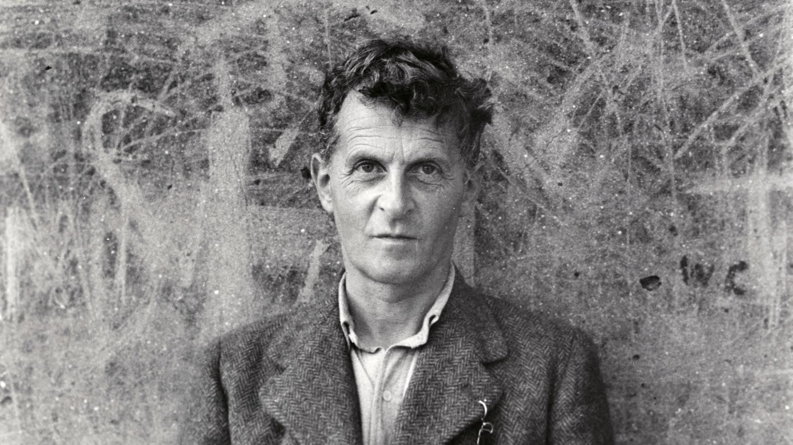

 
# Welcome

Hello and welcome to my small collective space of thoughts, tools and tricks. 

My name is Dominik, I have studied Computer Science, Physics as well as Philosphy in Munich and in Vienna.
I am deeply curious about ... things. And non-things.

What can you expect or find here?
Mostly Work about on the intersection of Computer Science & Philosophy. 

With this project I am aiming to connect Computer Science, Mathematics, Philosophy and us humans.
On the side, I try to deepen my own understanding of this funny little universe we've fortunately been placed into. 

Feel free to reach out to me any time via *info[at]dominik-pichler[dot]com*

[Here's also a little index](test.md)

