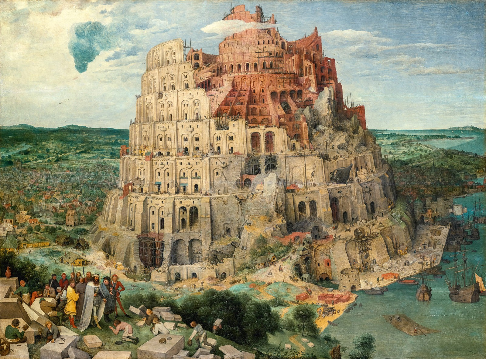

 
 
 

Welcome to my small collective space of thoughts, tools and tricks. 

My name is Dominik and I am deeply curious about Knowledge (Graphs), Semantics, Cognition, Limitations of modelling. Here I am aiming to connect Computer Science, Mathematics, Philosophy and People.
With the help of this blog, I am trying to do more by doing less. 
More of the stuff that really matters and less of the cluttering dust of unimportantness. 

Feel free to reach out to me any time via *info[at]dominik-pichler[dot]com*

